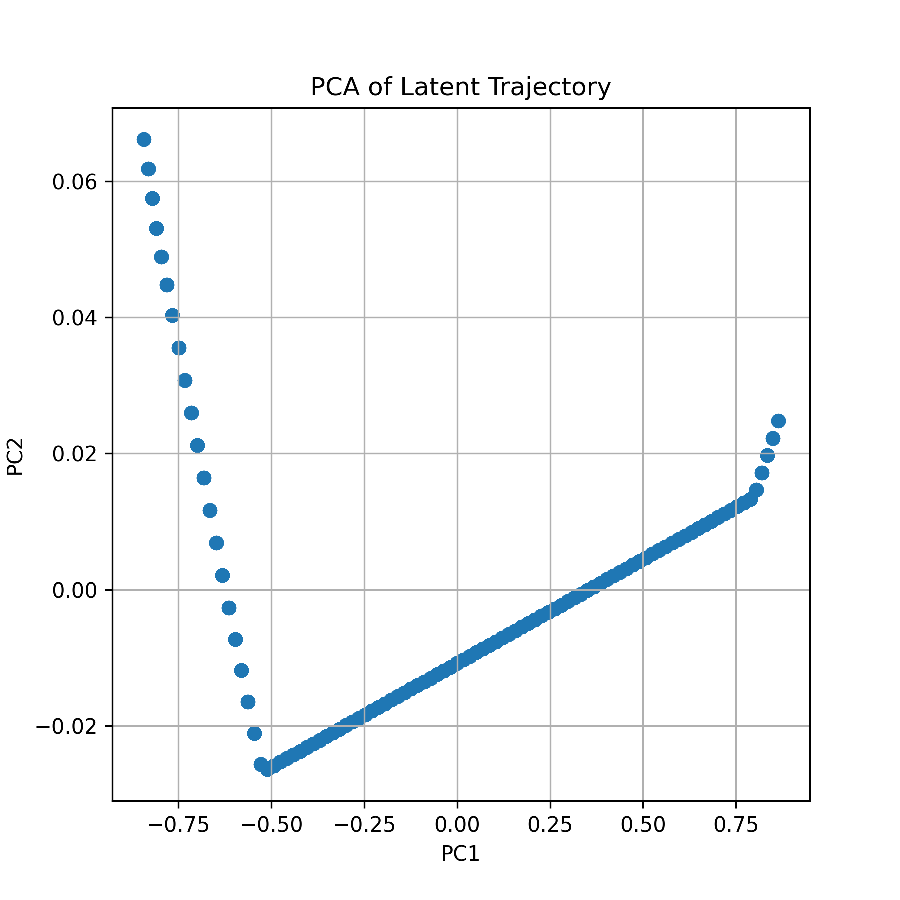
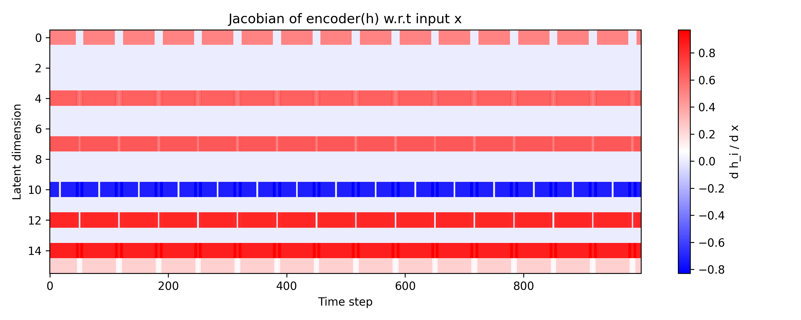
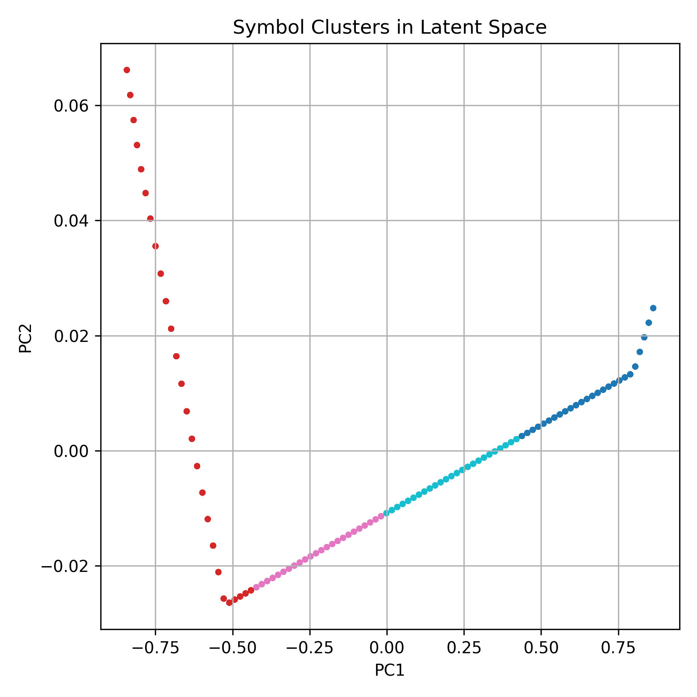
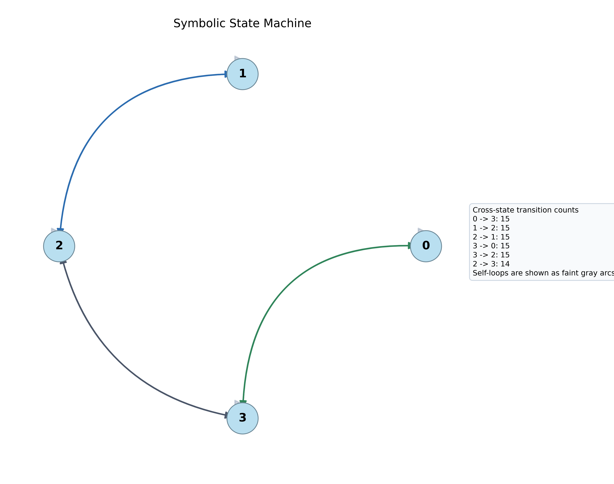
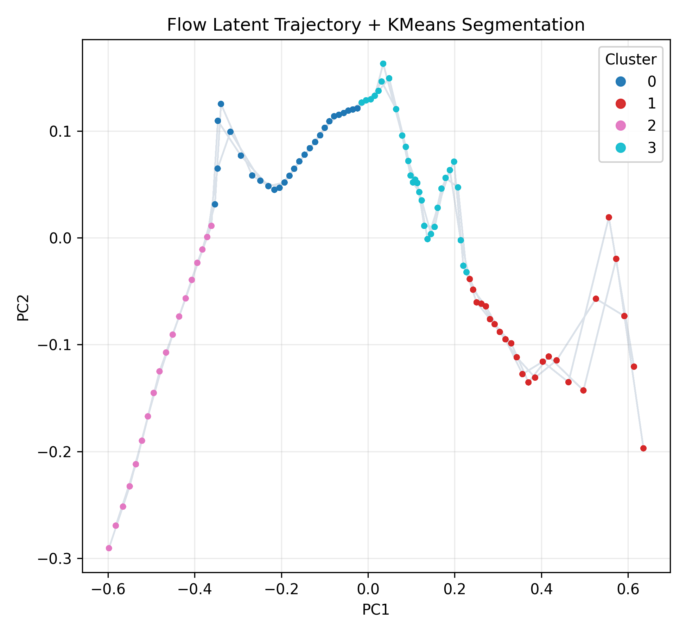
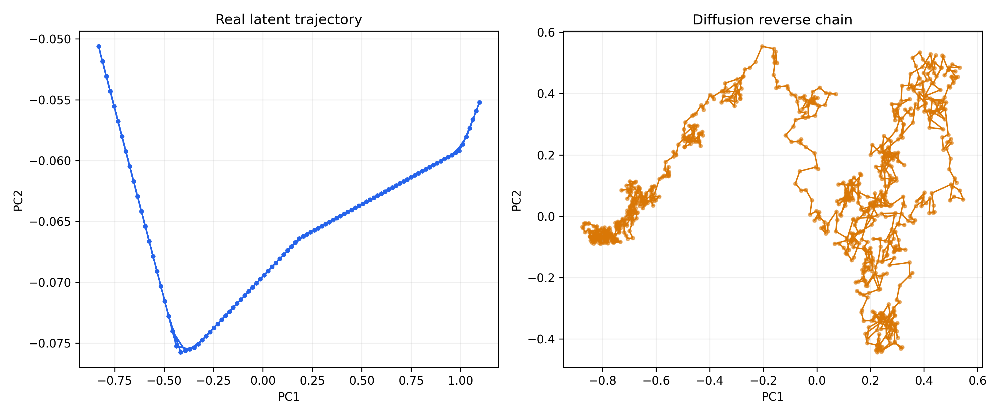

# Symbol Emergence in a 1D World Model

This repository accompanies a mechanistic study of symbolic boundary formation in predictive world models.

This repository explores how **discrete symbolic structure** can emerge from **continuous predictive dynamics** in a minimal one-dimensional environment.  
The project presents a mechanistic analysis of how **latent geometry**, **Jacobian discontinuities**, and **transition structure** give rise to symbolic boundaries.

The main contribution is a mechanistic explanation of how symbolic boundaries arise from Jacobian discontinuities and predictive-regime transitions in a minimal 1D world model.

---

## Full Report (Mini Preprint)

The full mechanistic analysis—including methods, results, figures, and references—is available here:

<p align="center">
  <a href="report/mini_report.md" style="display:inline-block;padding:10px 18px;border-radius:999px;background:#111827;color:#ffffff;text-decoration:none;font-weight:700;letter-spacing:0.2px;">
    Open Mini Report / Preprint Draft
  </a>
  <a href="report/mini_report.pdf" style="display:inline-block;padding:10px 18px;border-radius:999px;background:#0f766e;color:#ffffff;text-decoration:none;font-weight:700;letter-spacing:0.2px;margin-left:8px;">
    Open mini_report.pdf
  </a>
</p>

The README provides a concise overview; the report contains the full technical details.

For a map of the report folder itself, see [report/README.md](report/README.md).

---

## Why Symbolic Boundaries Emerge (Mechanistic View)

The following points summarize the core mechanistic findings.

- The latent trajectory segments because the world model must represent different predictive regimes with different local geometry.
- The encoder Jacobian jumps when ReLU activation patterns change, which happens near collision-like regime transitions.
- Those Jacobian jumps mark where the model's local sensitivity changes most sharply.
- Symbolic boundaries appear when these local regime changes are stable enough to be clustered into discrete regions.
- K-means turns the continuous latent manifold into a small set of symbolic states.
- The resulting state sequence forms a compact transition graph that summarizes the environment's dynamics.

## Creative Informatics Relevance

This section outlines how the mechanistic findings relate to Creative Informatics themes.

- Symbolic boundaries as world structure
- Jacobian discontinuities as event-driven segmentation
- Latent piecewise geometry as world rules
- Potential applications: NPC logic, town systems, exploration dynamics

---

## Key Mechanistic Insights

This project suggests that **symbolic boundaries** can emerge when a predictive model must represent **structurally different predictive regimes**.

### • Latent Manifold  
PCA shows that the latent trajectory lies on a **smooth, low‑dimensional manifold** rather than a scattered cloud.  
The world model compresses continuous dynamics into a structured trajectory.

### • Jacobian Discontinuities  
Because the encoder is piecewise linear, changes in ReLU activation patterns produce **sharp Jacobian jumps**.  
These jumps align with physical event boundaries (wall collisions), providing a mechanistic marker of symbolic segmentation.

Jacobian jumps mark event-driven segmentation.

### • Symbol Clustering  
K‑means discretizes the latent manifold into **phase‑like segments**, each corresponding to a distinct predictive regime.

Clustering turns geometry into symbolic states.

### • Symbolic State Machine  
The sequence of cluster assignments forms a **discrete symbolic state sequence**, which induces a compact **state‑transition graph** summarizing predictive dynamics.

The state sequence forms a compact transition graph.

### • Model Robustness (Flow & Diffusion)  
- **Flow models** preserve segmentation‑like boundaries because invertible maps cannot create or destroy topological structure.  
- **Diffusion reverse chains** reproduce **similar large‑scale geometric bends**, though with stochastic dispersion.  
Taken together, these results suggest that symbolic boundaries arise primarily from the **environment’s predictive structure**, not from a specific architecture, and that both flow and diffusion models reproduce the same large-scale geometric trend.

<p align="center">
  
</p>

Pipeline overview: world model, latent geometry, clustering, and graph structure.

---

## 1. Overview

This study investigates the hypothesis:

> **Symbolic boundaries arise when predictive dynamics undergo structural changes.**

Using a deterministic 1D bouncing‑ball environment, we observe:

- Latent trajectories become **piecewise‑linear**  
- Encoder Jacobian exhibits **sharp discontinuities** at collisions  
- These discontinuities align with **emergent symbolic states**  
- Flow and diffusion models reveal **consistent geometric trends**  
- A discrete **symbolic state machine** emerges from continuous dynamics

These observations motivate a representation-level view of symbolic emergence.

---

## 2. Repository Structure

```text
symbol-emergence-world-models/
│
├── model/                # World model, flow, diffusion
├── analysis/             # PCA, Jacobian, clustering, state machine
│   └── plots/            # Generated figures
├── results/              # Latent, samples, model weights
├── report/               # mini_report + final figures
└── README.md
```

---

## 3. Key Results

### Latent PCA
<p align="center">

</p>

Latent trajectories form segmented linear regions, indicating distinct predictive regimes.

Latent PCA reveals segmented regimes.

### Jacobian Discontinuity
<p align="center">

</p>

Encoder Jacobian shows sharp structural changes at bounce events —
a mechanistic origin of symbolic boundaries.

Jacobian discontinuities align with collision events.

### Symbol Clusters & State Machine
<p align="center">


</p>

Discrete symbolic states emerge naturally, forming a predictive state‑transition graph.

Clustering turns the manifold into discrete symbolic states.

### Flow & Diffusion Dynamics
<p align="center">


</p>

Flow models preserve segmentation‑like boundaries via invertible reparameterizations.
Diffusion reverse chains reproduce similar geometric bends with stochastic dispersion.

Flow and diffusion preserve the shared geometric trend.

---

## 4. Methods (Brief)

Environment: 1D bouncing ball (deterministic)

World Model: encoder → transition → decoder

Flow Model: RealNVP on latent space

Diffusion Model: denoising latent dynamics

Analysis: PCA, Jacobian, clustering, symbolic transition graph

Full details are in the report.

---

## 5. Run
Windows:

```bat
run.bat
run.bat all
scripts\\run_all.bat
```

Or run individual stages:

```bat
run.bat world
run.bat flow
run.bat diffusion
```

### 2D GridWorld Update

The 2D spatial-analysis update is now available as a one-key workflow:

```bat
run.bat gridworld
```

You can also invoke the underlying steps directly:

```bat
python envs/collect_2d.py
python model/train.py --mode world --data-path data/trajectories_2d.npy --state-dim 2 --epochs 20 --batch-size 32 --latent-dim 16
python analysis/run_analysis.py
python analysis/segmentation.py
```

This generates the 2D Jacobian norm map, predictive entropy map, symbolic cluster map, and symbol MI matrix under `report/figures/gridworld/`.

For a code-reading guide that traces the full path from raw rollout to figures, see [report/2d_section.md](report/2d_section.md).

## 6. Toward Social Symbol Emergence

While this project focuses on individual symbol emergence, future work aims to extend this framework to multi‑agent systems where communication stabilizes shared symbolic categories.

- Agents align or negotiate symbolic categories.
- Communication stabilizes shared symbols.
- Symbol systems emerge at the societal level.

## 7. Citation
A preprint is in preparation.
If you find this project useful, please star the repository or cite the report.

A full preprint is currently being finalized and will be released soon.

---

## 8. Contact
For inquiries or collaboration, please contact:

Xu Wenxuan  
Ningbo University of Technology
GitHub: https://github.com/bunxuan  
Email: jyosa@nbut.edu.cn