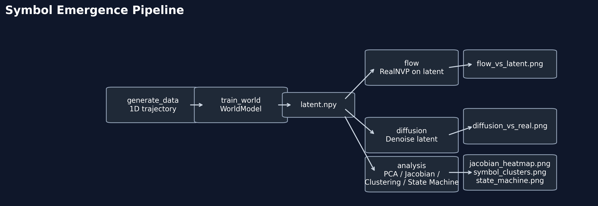

# Symbol Emergence from Predictive Dynamics in a World Model

This repository accompanies a mechanistic study of how **discrete symbolic boundaries** emerge from **continuous predictive dynamics** in minimal world models.

The main contribution is a mechanistic explanation: latent geometry, Jacobian discontinuities, and temporal predictive structure give rise to symbolic states—and that emergence breaks down when the environment’s temporal coherence is removed.

---

## Full Report (Mini Preprint)

The complete analysis—methods, results, figures, and discussion—is available here:

<p align="center">
  <a href="report/mini_report.md" style="display:inline-block;padding:10px 18px;border-radius:999px;background:#111827;color:#ffffff;text-decoration:none;font-weight:700;letter-spacing:0.2px;">
    Open Mini Report / Preprint Draft
  </a>
  <a href="report/mini_report.pdf" style="display:inline-block;padding:10px 18px;border-radius:999px;background:#0f766e;color:#ffffff;text-decoration:none;font-weight:700;letter-spacing:0.2px;margin-left:8px;">
    Open mini_report.pdf
  </a>
</p>

For a map of the report folder, see [report/README.md](report/README.md).

---

## Why Symbolic Boundaries Emerge (Mechanistic View)

- The latent space organizes into a **piecewise‑smooth manifold** because the world model must represent different predictive regimes (free motion, collision, rebound) with different local geometry.
- **Jacobian discontinuities** appear when ReLU activation patterns switch, providing a local, differentiable marker of regime transitions.
- **Predictive entropy peaks** align with these Jacobian spikes, showing that the model’s uncertainty concentrates at the same boundaries.
- **Clustering** the latent trajectory yields discrete symbolic states; their transition graph summarizes the environment’s dynamics.
- A **randomization control** shows that when temporal order is destroyed, the symbolic structure disintegrates—proving that temporal predictive structure, not network architecture, is necessary for emergence.

---

## Key Findings at a Glance

| Analysis | What it shows |
|----------|---------------|
| Latent geometry (PCA) | Smooth manifold that bends at event boundaries |
| Jacobian discontinuity | Regime switching reflected as sensitivity jumps |
| Predictive entropy | Uncertainty spikes align with Jacobian peaks |
| Symbol clustering & state machine | Discrete symbols and compact transition graph |
| Flow & diffusion comparison | Same boundaries appear across architectures |
| Randomization control | Symbol structure vanishes without temporal order |
| 2D GridWorld | Walls, corners, doorways become symbolic boundaries |

---

## Pipeline Overview

<p align="center">
  
</p>

Pipeline: world model → latent geometry → clustering → symbolic graph.

---

## Repository Structure

```text
symbol-emergence-world-models/
│
├── model/                # World model, flow, diffusion
├── analysis/             # PCA, Jacobian, clustering, state machine
│   └── plots/            # Generated figures
├── results/              # Latent, samples, model weights, randomization
├── report/               # mini_report + final figures
└── README.md
---

## 5. Run
Windows:

```bat
run.bat
run.bat all
scripts\\run_all.bat
```

Or run individual stages:

```bat
run.bat world
run.bat flow
run.bat diffusion
run.bat randomization
```

### 2D GridWorld Update

The 2D spatial-analysis update is now available as a one-key workflow:

```bat
run.bat gridworld
```

You can also invoke the underlying steps directly:

```bat
python envs/collect_2d.py
python model/train.py --mode world --data-path data/trajectories_2d.npy --state-dim 2 --epochs 20 --batch-size 32 --latent-dim 16
python analysis/run_analysis.py
python analysis/segmentation.py
```

This generates the 2D Jacobian norm map, predictive entropy map, symbolic cluster map, and symbol MI matrix under `report/figures/gridworld/`.

For a code-reading guide that traces the full path from raw rollout to figures, see [report/2d_section.md](report/2d_section.md).

### Randomization Control Study

To test whether symbol emergence depends on meaningful trajectory structure, run:

```bat
run.bat randomization
```

This keeps the model, loss, and analysis settings fixed, and only changes trajectory order at noise ratios `0%, 20%, 100%`. Outputs are saved under `results/randomization/`, including:

- per-ratio latent/PCA/entropy/Jacobian/MI artifacts
- `results/randomization/figures/randomization_metric_trends.png`
- `results/randomization/figures/original_vs_100_shuffled_pca.png`
- `results/randomization/summary_metrics.json`

## 6. Toward Social Symbol Emergence

While this project focuses on individual symbol emergence, future work aims to extend this framework to multi‑agent systems where communication stabilizes shared symbolic categories.

- Agents align or negotiate symbolic categories.
- Communication stabilizes shared symbols.
- Symbol systems emerge at the societal level.

## 7. Citation
A preprint is in preparation.
If you find this project useful, please star the repository or cite the report.

A full preprint is currently being finalized and will be released soon.

---

## 8. Contact
For inquiries or collaboration, please contact:

Xu Wenxuan  
Ningbo University of Technology
GitHub: https://github.com/bunxuan  
Email: jyosa@nbut.edu.cn