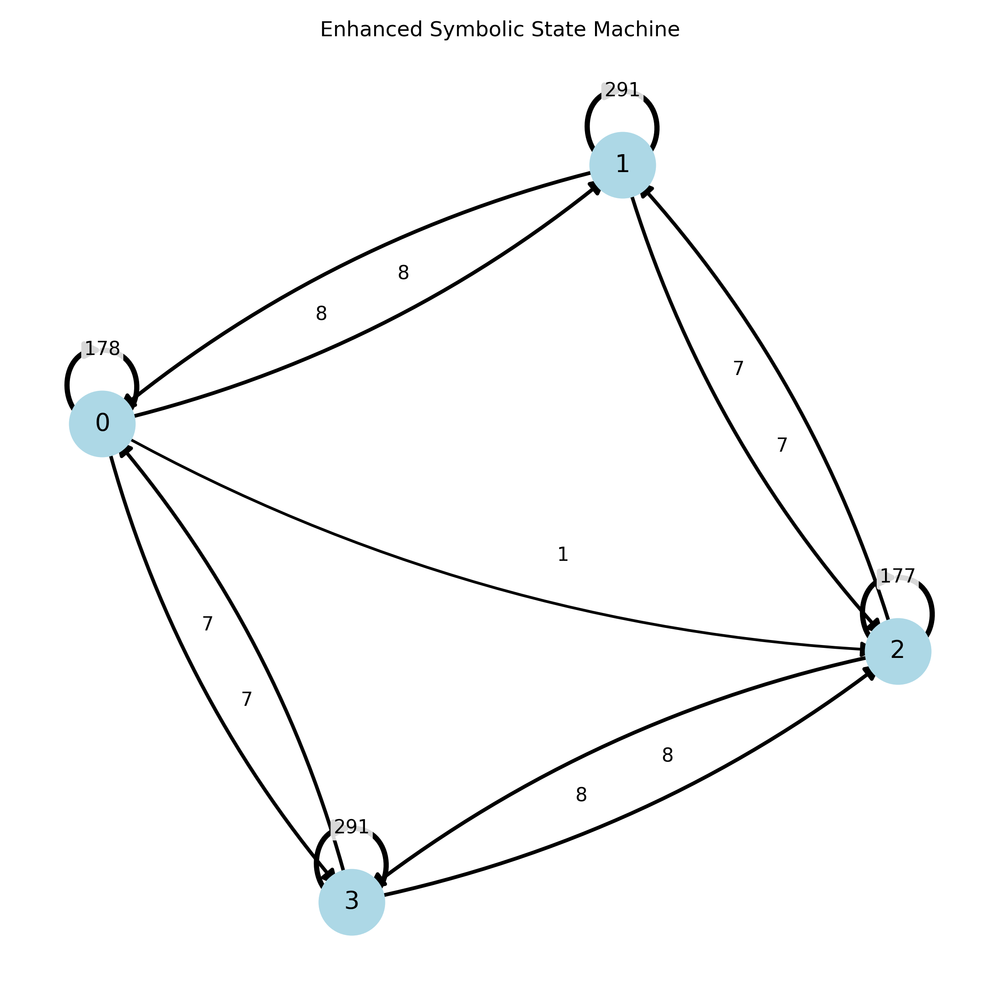
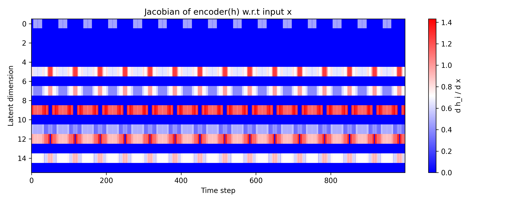
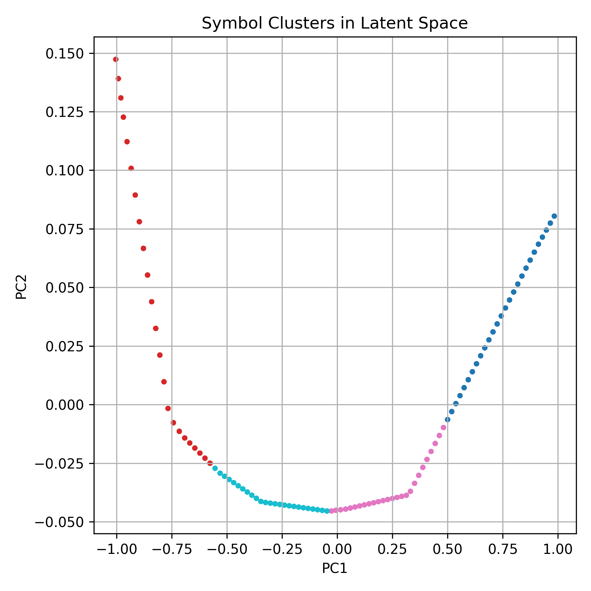

# Symbol Emergence in a 1D World Model

A compact investigation of how discrete symbolic regimes emerge from continuous latent dynamics.

This repository presents a preliminary investigation of symbol emergence in a learned world model using a 1D bouncing‑ball environment.
The goal is to examine whether continuous trajectories can be compressed into latent representations that support discrete symbolic states and state transitions.

## Research Motivation

Understanding how symbolic structure arises from continuous sensory dynamics is a central question in Symbol Emergence and Cognitive Systems.
This minimal 1D setup provides a controlled environment to study how latent representations develop piecewise-linear structure, transition boundaries, and symbol-like regimes.
The same methodology will later be extended to 2D physics, GridWorld agents, and multimodal environments.

## Results Overview

The following figures illustrate how discrete symbolic regimes emerge from continuous latent dynamics, revealing the transition from continuous representation to symbolic abstraction.
<table>
<tr>
<td colspan="2" align="center">

<br>
<strong>Symbolic State Machine</strong><br>
Emergent symbolic states and their cross-state transition counts.
</td>
</tr>
<tr>
<td align="center" width="50%">

<br>
<strong>Jacobian Heatmap</strong><br>
Encoder sensitivity and transition boundaries in latent space.
</td>
<td align="center" width="50%">

<br>
<strong>Symbol Clusters</strong><br>
Latent-only clustering of emergent symbolic states.
</td>
</tr>
</table>

## Pipeline

1. Generate a 1D bouncing trajectory.
2. Train a compact world model to predict the next position.
3. Analyze the latent trajectory with PCA.
4. Compute the encoder Jacobian.
5. Cluster latent states.
6. Build a symbolic state-transition graph.

This pipeline demonstrates how symbolic abstraction can be systematically derived from continuous world-model dynamics.
## How to Run

```bash
bash scripts/all.sh
```

## Project Summary

continuous dynamics -> latent encoding -> discrete symbolic states -> transition system

This project is intended as a compact research prototype for Symbol Emergence and Cognitive Systems, with planned extensions to higher-dimensional environments and more complex symbolic structure.
