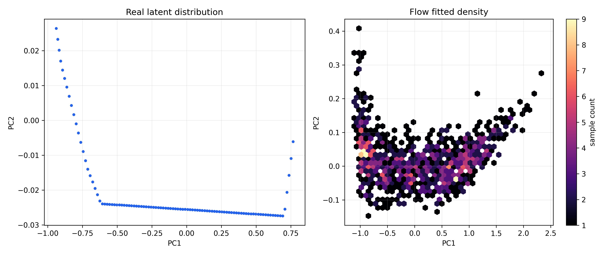
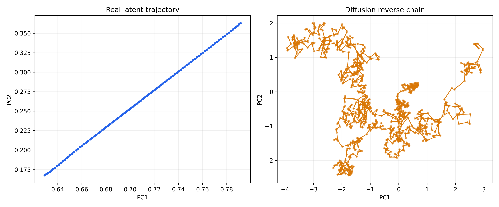

A preprint based on this repository is currently in preparation.

# Symbol Emergence from Predictive Dynamics in a 1D World Model
_A mechanistic study of how discrete symbolic structure arises from continuous latent dynamics_

---

## 1. Introduction

Understanding how discrete symbolic structure can emerge from continuous sensorimotor experience 
is a central question in cognitive science and machine learning. World models trained on prediction 
tasks provide a minimal setting in which such structure may arise: the model must compress 
continuous dynamics into an internal representation that supports accurate forecasting. This raises 
a natural question: does the latent space of a predictive model contain interpretable structure, and 
if so, how does this structure relate to the underlying dynamics of the environment?

To investigate this question, we analyze the latent representations of a simple world model trained 
on a one-dimensional bouncing-ball environment. This environment provides a controlled setting in 
which continuous motion is punctuated by discrete events, allowing us to examine how predictive 
models respond to changes in dynamical regimes.

Our approach combines geometric analysis of the latent trajectory with differential and 
clustering-based methods. PCA is used to visualize the global structure of the latent space, while 
the encoder Jacobian can reveal local changes in sensitivity to the input. Clustering the latent 
trajectory further exposes discrete segments that correspond to qualitatively different predictive 
phases.

Across multiple architectures—including MLPs, flow models, and diffusion models—we observe a 
similar pattern: the latent trajectory appears to form a smooth manifold segmented by 
sharp transitions that appear to align with event boundaries in the environment. These segments can 
be interpreted as symbolic states, and their transitions form a simple state machine that reflects 
the environment’s predictive structure.

This minimal setting allows us to examine how symbolic structure may emerge from predictive 
processing alone, without explicit supervision or predefined categories. The analysis provides a 
foundation for extending symbol emergence studies to more complex environments and, ultimately, to 
multi-agent systems in which symbolic categories may be shared or negotiated.

---

## 2. Methods

### Training Procedure

The model is trained with gradient-based optimization to minimize prediction loss. Backpropagation 
computes gradients of the loss with respect to the model parameters, and the optimizer updates the 
parameters iteratively using a fixed learning rate until the predictive error decreases.

### Latent Geometry Analysis (PCA / SVD)

We apply Principal Component Analysis (PCA) to the centered latent vectors to visualize the dominant 
directions of variation in latent space. Because PCA is equivalent to SVD on the centered data 
matrix, the first principal component corresponds to the direction of maximal stretching of the latent 
trajectory. This projection allows us to assess whether the latent representation forms a coherent 
low-dimensional manifold rather than an unstructured cloud.

### Environment
We use a deterministic 1D bouncing-ball environment. The agent observes the ball’s position over time, and the only events are left-wall and right-wall collisions. This environment provides a clean setting to study how symbolic boundaries arise from predictive dynamics.

### World Model
The world model consists of an encoder, a linear transition model, and a decoder. The encoder maps observations to a low-dimensional latent space, the transition model predicts the next latent state, and the decoder reconstructs the observation. The model is trained using reconstruction and prediction loss.

### Flow Model
A RealNVP flow model is trained on the latent trajectories to examine the reversible geometry of the latent space. The flow can be used to examine whether symbolic boundaries are approximately preserved under invertible transformations.

### Diffusion Model
A denoising diffusion model is trained on latent trajectories to study the generative dynamics. The reverse diffusion chain is compared with real latent trajectories to test whether symbolic segmentation is retained.

### Analysis Pipeline
We analyze latent geometry using PCA, compute encoder Jacobians to detect structural changes, cluster latent states into symbolic categories, and construct a symbolic state-transition graph.

---

## 3. Results

### Latent Geometry
PCA suggests that latent trajectories form segmented linear regions. These segments appear to align with physical bounce events, suggesting the emergence of discrete regimes.

	

(Figure 2: Latent PCA)

### Jacobian Discontinuity
The encoder Jacobian exhibits pronounced structural changes at bounce events. These discontinuities appear to correspond to symbolic boundaries in the latent space.

	

(Figure 3: Encoder Jacobian)

### Symbolic Clusters
Clustering the latent states yields a discrete set of symbolic categories. Each cluster can be associated with a distinct dynamical regime of the environment.

	

(Figure 4: Symbol Clusters)

### Symbolic State Machine
From the clustered latent states, we construct a symbolic state-transition graph. The resulting structure summarizes the predictive dynamics of the environment in discrete form.

	

(Figure 5: State Machine)

### Flow and Diffusion Models
Both the flow model and the diffusion model preserve a similar symbolic segmentation. This suggests that the observed boundaries are not specific to a single model choice but reflect structure in the predictive dynamics.

	

(Figure 6: Flow Geometry)

	

(Figure 7: Diffusion Dynamics)

---

## 4. Discussion

### Continuous Manifold and Predictive Structure
PCA suggests that the latent representation does not form an unstructured cloud but instead appears to evolve along a smooth, low‑dimensional manifold. This may indicate that the world model organizes the environment’s continuous dynamics into a coherent geometric structure, rather than distributing information arbitrarily across latent dimensions.

### Jacobian Discontinuities and the Origin of Symbolic Boundaries
Because the encoder is piecewise‑linear, each ReLU activation pattern defines a distinct local linearization. When the environment reaches an event boundary, the activation pattern switches, producing a discontinuous change in the Jacobian. In our experiments, these Jacobian jumps often appear near physical bounce events. This observation suggests that symbolic boundaries emerge when the model must transition between different predictive regimes, and the Jacobian provides a useful mechanistic marker of these transitions.

### Discretization of the Latent Manifold
Applying k‑means to the latent trajectory discretizes the continuous manifold into segments that correspond to qualitatively different predictive phases. Coloring the trajectory by cluster assignment makes these segments visible, revealing segments that can be interpreted as emergent symbolic states embedded within the continuous dynamics.

### Symbolic State Machine
The sequence of cluster assignments forms a discrete symbolic trajectory. Aggregating transitions between clusters yields a symbolic state machine that summarizes the environment’s predictive structure in discrete form. This provides a compact representation of how continuous dynamics give rise to discrete symbolic behavior.

### Robustness Across Models
Both flow and diffusion models preserve a similar segmentation pattern. Flow models are constrained by invertibility and therefore do not by themselves introduce new boundaries, while diffusion reverse chains reconstruct comparable directional changes at the same locations. These observations suggest that the symbolic structure is not tied to a specific architecture but is largely influenced by the environment’s predictive dynamics.

### Toward a Broader View of Symbol Emergence
The present work focuses on symbol emergence within a single agent. In multi‑agent settings, symbolic categories may be shared, aligned, or negotiated through communication. The minimal framework explored here provides a starting point for examining how individually formed symbolic structures may interact and evolve into shared symbol systems, as discussed in Symbol Emergence Systems (2026).

---

## Conclusion

In this work, we examined how discrete symbolic structure can emerge within the latent space of 
predictive world models trained on a simple dynamical environment. Our analysis suggests that the 
latent trajectory appears to form a smooth, low‑dimensional manifold segmented by sharp transitions 
in the encoder Jacobian. These transitions appear to coincide with changes in the environment’s 
predictive regime, providing a plausible mechanism for the formation of symbolic boundaries.

By discretizing the latent manifold with k‑means, we obtained symbolic states whose transitions form 
a compact state machine that reflects the underlying dynamics of the environment. Similar patterns 
were observed across MLPs, flow models, and diffusion models, suggesting that the emergence of such 
structure is influenced more by the environment’s dynamics than by any specific architectural choice.

These findings highlight how symbolic structure may arise from predictive processing alone, without 
explicit supervision or predefined categories. While the present study focuses on a minimal 
one‑dimensional setting, the same analytical framework may be extended to richer environments and, 
ultimately, to multi‑agent systems where symbolic categories can be shared or negotiated. Such 
extensions may provide further insight into how individual predictive representations develop into 
shared symbol systems.

---

## Appendix (optional)

### Appendix: Mathematical Background (PCA and SVD)

PCA can be interpreted geometrically as fitting an ellipsoid to the centered data cloud. Centering is 
necessary because PCA assumes that the linear transformation acts around the origin; without 
centering, the mean shift would be interpreted as variance.

Given a centered data matrix X, PCA seeks directions v that maximize the projected variance:

    maximize   vᵀ (Xᵀ X) v
    subject to ||v|| = 1

The solution is given by the eigenvectors of XᵀX, with the largest eigenvalue corresponding to the 
first principal component.

SVD provides an equivalent and more geometric interpretation. Any linear transformation maps the 
unit circle into an ellipse whose axes correspond to the singular vectors. The first right singular 
vector identifies the direction of maximal stretching, which is identical to the first principal 
component. Thus, PCA can be computed directly via the SVD of the centered data matrix:

    X = U Σ Vᵀ

where the columns of V are the principal directions and the squared singular values Σ² correspond to 
the explained variances.

- Hyperparameters
- Training curves
- Additional visualizations
