A preprint based on this repository is currently in preparation.
This work investigates how symbolic structure emerges from world dynamics, with potential applications to game worlds, NPC behavior, and structured environments.

<p align="center">
	<a href="../README.md" style="display:inline-block;padding:10px 18px;border-radius:999px;background:#111827;color:#ffffff;text-decoration:none;font-weight:700;letter-spacing:0.2px;">
		Back to Project README
	</a>
</p>


# Symbol Emergence from Predictive Dynamics in a 1D World Model
_A mechanistic study of how discrete symbolic structure arises from continuous latent dynamics_

---
## Abstract

This report investigates how discrete symbolic structure can emerge from the predictive geometry of a learned world model.  
In a 1D bouncing-ball environment, the latent space organizes into piecewise-smooth regions corresponding to distinct predictive regimes, and Jacobian discontinuities mark transitions between these regimes.  
Clustering these regions yields a symbolic segmentation whose transition graph reflects the underlying dynamics.  
The mechanism is model-independent: MLP, flow, and diffusion models all reproduce the same geometric boundaries despite architectural differences.

We extend the analysis to a 2D GridWorld and show that the same predictive-geometry mechanism scales to spatial environments.  
Walls, corners, and doorways induce geometric bends and sensitivity spikes, producing symbolic regions aligned with rooms and corridors.  
Mutual information between symbolic states recovers the adjacency structure of the environment, demonstrating that symbolic boundaries arise from changes in predictive organization rather than external labels.

Together, these results provide a unified account of how discrete symbols can emerge from continuous predictive experience, offering a foundation for future work on multi-agent symbol negotiation and shared semantic structure.


## 1. Introduction
Understanding how discrete symbolic structure can emerge from continuous experience is a central question in cognitive science and machine learning.

Predictive world models provide a minimal setting in which such structure may arise: to forecast future states, the model must compress continuous dynamics into an internal representation that supports accurate prediction. This raises a fundamental question: what structure does a predictive model impose on its latent space, and how does this structure relate to the environment's dynamics?

To investigate this question, we analyze the latent representations of a world model trained on a simple one-dimensional bouncing-ball environment. This environment offers a controlled testbed in which continuous motion is punctuated by discrete events, allowing us to isolate how predictive models respond to changes in dynamical regimes. Despite its simplicity, the setting captures the essential challenge of symbol emergence: continuous trajectories must be organized into discrete, behaviorally meaningful units.

Our analysis combines geometric, differential, and clustering-based methods. PCA reveals the global organization of the latent trajectory, while the encoder Jacobian exposes local changes in sensitivity that provide a differential signature of regime transitions. Clustering the latent states further reveals discrete segments corresponding to qualitatively distinct phases of the environment's dynamics. The repository-consistent experimental settings are default latent_dim=16, KMeans k=4, and analysis sample size N=999 latent states (see Appendix for implementation details).

Across multiple architectures—including multi-layer perceptrons (MLPs), invertible flow models, and diffusion models—we observe a consistent pattern: the latent trajectory forms a smooth manifold segmented by sharp transitions aligned with event boundaries. These segments can be interpreted as symbolic states, and their transitions form a compact state-transition graph summarizing the predictive structure of the environment. The cross-model consistency suggests that the observed symbolic boundaries arise from the environment's predictive dynamics rather than architecture-specific inductive biases.

This minimal framework allows us to examine how symbolic structure may emerge from prediction alone, without supervision or predefined categories, and provides a mechanistic foundation for extending symbol-emergence studies to richer environments and, ultimately, to multi-agent systems.


## Related Work
Research on symbol emergence has examined how discrete categories can arise from continuous sensorimotor experience. Prior work describes symbol emergence as a multi-layered process involving individual representation learning, multimodal categorization, and eventually the formation of shared symbol systems within society. Other studies highlight how agents acquire internal categories through interaction and prediction. Unlike these approaches, our analysis focuses on the mechanistic origin of symbolic boundaries within predictive latent dynamics, even without multimodality or social interaction.

Predictive world models provide a minimal setting for studying such emergence. Earlier studies on predictive coding and learned dynamics have shown that latent spaces often reflect environmental structure, but these works typically emphasize performance or compression rather than the geometry of the latent trajectory. In contrast, we analyze how predictive regimes shape the latent manifold itself, and how discrete symbolic states may arise from transitions between these regimes.

Our approach is also related to research on representation geometry and mechanistic interpretability, which uses tools such as PCA, SVD, and Jacobian analysis to study the structure of learned representations. Prior work has examined curvature, linear regions, and activation patterns in neural networks, but has not connected these geometric features to the emergence of symbolic structure. Jacobian discontinuities provide a direct mechanistic link between predictive dynamics and symbolic segmentation.

Finally, our analysis draws on flow-based and diffusion-based generative models. Flow models provide invertible mappings that preserve structural boundaries, while diffusion models reconstruct trajectories through iterative denoising. Although typically used for density estimation or generation, we show that both models preserve large-scale geometric trends relevant to segmentation. This supports the view that observed boundaries are primarily driven by the environment's predictive structure rather than architectural artifacts.

---

## 2. Methods

### Training Procedure

The world model is trained by gradient-based optimization to minimize prediction loss.

### Environment

We use a deterministic one-dimensional bouncing-ball environment in which the agent observes the ball position over time and the only discrete events are left-wall and right-wall collisions. This setting isolates how symbolic boundaries arise from predictive dynamics.

### World Model

The world model combines an encoder and decoder in a low-dimensional latent space, and it is trained to reconstruct observations while forecasting the next step.

### Flow Model

A RealNVP flow model is trained on the latent trajectories to probe the reversible geometry of the representation. Because the flow is invertible, it provides a direct test of whether symbolic boundaries persist under a bijective reparameterization.

### Diffusion Model

A denoising diffusion model is trained on latent trajectories to study the generative dynamics. Its reverse chain is compared with the real latent trajectory to test whether the same segmentation reappears under iterative denoising.

### Analysis Pipeline

We analyze latent geometry with PCA, detect local structural changes with encoder Jacobians, cluster latent states into symbolic categories, and construct the induced state-transition graph.

## 3. Results

### 3.1 Latent Geometry and Symbol Segmentation

The latent geometry reveals how predictive regimes shape the internal representation.


Figure 2. PCA projection of the latent trajectory, showing a low-dimensional manifold with collision-marked breakpoints (N=999, seed=42; PCA shown on `model/latent.npy`).

The encoder Jacobian changes sharply at the same event locations, indicating nonuniform local sensitivity along the trajectory. 


Figure 3. Encoder Jacobian over time, highlighting sharp sensitivity changes aligned with collisions (N=999, seed=42; Jacobian computed via autograd on the trained `WorldModel`).

Clustering the latent states produces a small number of compact groups that partition the trajectory into discrete regions of the predictive latent space.


Figure 4. Symbol segmentation in latent space, where clustering partitions the trajectory into symbolic regions (KMeans, k=4, n_init=20, random_state=0; N=999).

The resulting state-transition graph summarizes the repeated switching pattern observed along the trajectory.


Figure 5. Symbolic state-transition graph summarizing transitions among the inferred states (derived from clustered latent sequence; k=4).

### 3.2 Flow Model Analysis (Model Independence)

Flow models preserve segmentation because invertible maps cannot merge or create boundaries.
Because flows are invertible, they provide a natural test of whether the observed segmentation persists under a bijective transformation of the latent space.


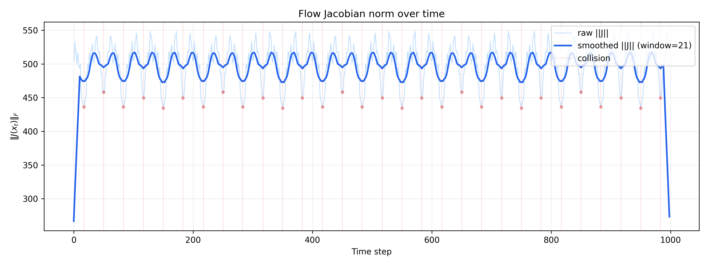

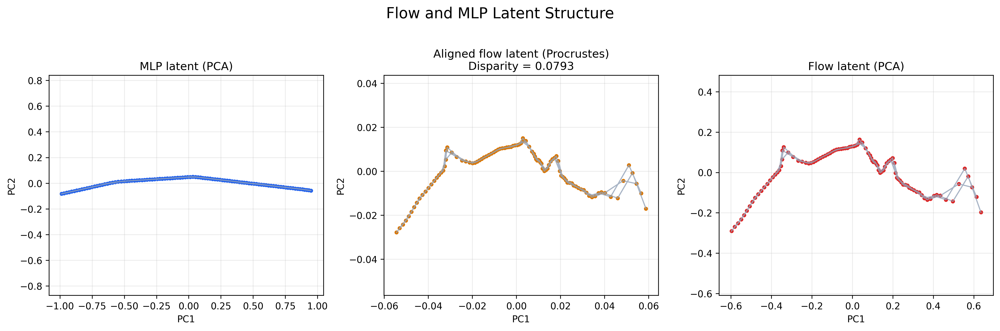

Figure 6. Flow-model comparison, showing that the segmentation survives an invertible reparameterization (flow samples Procrustes-aligned to `model/latent.npy`; N=999; Procrustes with scaling).

### 3.3 Diffusion Model Analysis

Diffusion models reproduce large-scale bends because denoising follows the manifold geometry.

Diffusion models reconstruct data through iterative denoising, so they provide a complementary test of whether the same segmentation structure reappears in the generative setting.


Figure 7. Diffusion-model comparison, showing similar geometric transitions in the sampled trajectory, although with stochastic dispersion due to the diffusion reverse process (N=999, seed=42; reverse chain is stochastic).

### 3.4 Summary of Model-Independent Structure

Together, these results show that segmentation is preserved under both invertible and stochastic generative processes.
Despite their architectural differences, the MLP and flow models exhibit closely aligned segmentation patterns, while diffusion models reproduce similar large-scale geometric trends with greater dispersion. These observations suggest that the observed boundaries reflect environment-induced structure rather than model-specific inductive bias. The summary figure below combines the most informative views of this shared structure.

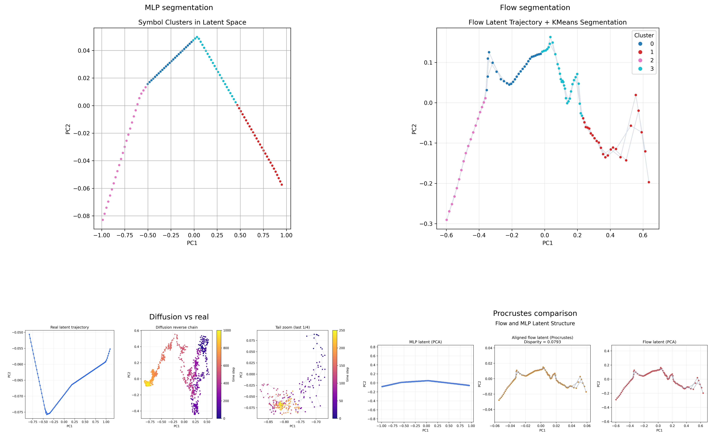

Figure 8. Cross-model segmentation summary, highlighting the shared segmentation pattern across models (flow samples Procrustes-aligned; clustering k=4; N=999).

## 4. Information-Theoretic Analysis

The geometric results above can also be phrased in terms of uncertainty, compression, and predictive dependence. Because the world model is deterministic, the predictive entropy curve is estimated with a local Gaussian approximation to the one-step residuals: $\sigma_t^2 \approx \mathrm{Var}_w(x_{t+1} - \hat{x}_{t+1})$ and $H_t \approx \frac12 \log(2\pi e\sigma_t^2)$.

### 4.1 Predictive Entropy Spike

The predictive entropy proxy spikes near the same collision boundaries that produce the strongest Jacobian changes. In the one-dimensional bouncing-ball environment, these peaks are expected because the next observation becomes locally harder to predict when the trajectory switches from free motion to post-impact motion. The entropy curve therefore provides a complementary uncertainty view of the same regime boundaries identified by the Jacobian.

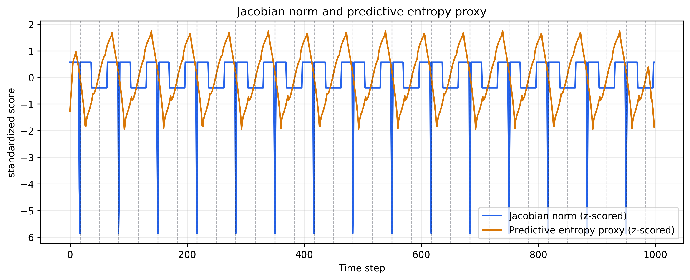

Figure 9a. Predictive entropy proxy and Jacobian norm over time. Both curves are standardized for comparison, and their peaks tend to align near collision-induced regime changes.

### 4.2 Segment Entropy

Segment entropy measures how concentrated each symbolic cluster is in latent space. We estimate $H(Z \mid S = k)$ for every cluster with a diagonal Gaussian approximation on the latent vectors assigned to that cluster, then average them to obtain $H(Z \mid S)$. Lower within-cluster entropy means each symbolic state occupies a tighter region of the latent manifold, while the gap $H(Z) - H(Z \mid S)$ measures how much structure the segmentation explains.

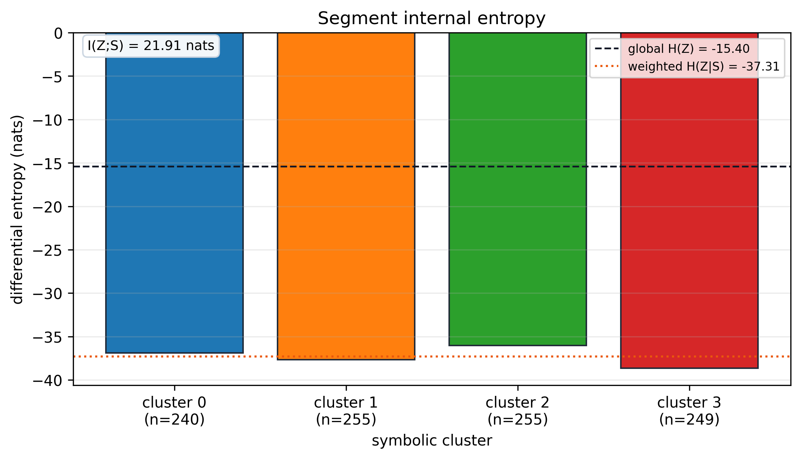

Figure 9b. Segment internal entropy in the clustered latent space. The global entropy line sits above the weighted conditional entropy when the partition captures meaningful latent structure.

### 4.3 Mutual Information of Symbols

The state machine exposes temporal dependence between symbolic states. We measure discrete mutual information between consecutive symbols, $I(S_t; S_{t+1})$, and also report normalized mutual information for scale comparison. Higher values indicate that the symbolic sequence retains predictive memory rather than behaving like a memoryless partition.

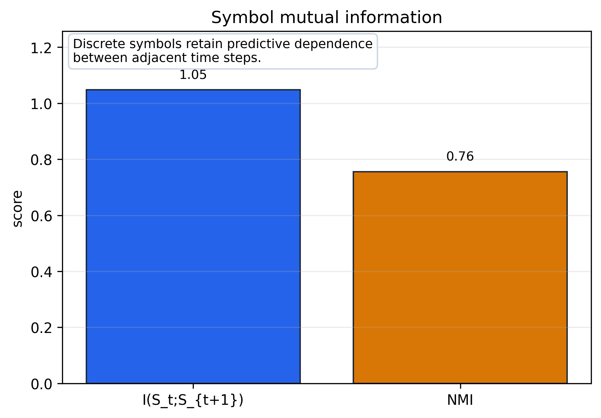

Figure 9c. Mutual information summary for the symbolic state sequence. The discrete symbols retain nontrivial predictive dependence across adjacent time steps.

### 4.4 Theoretical Lower Bound

The symbolic metrics above are conservative because clustering is a coarse-graining map, $S = q(Z)$. By the data processing inequality, the measured symbolic mutual information satisfies $I(S_t; S_{t+1}) \le I(Z_t; Z_{t+1})$, so the discrete FSM gives a lower bound on the predictive information present in the continuous latent trajectory. Equivalently, the entropy gap $H(Z) - H(Z \mid S)$ is the amount of latent structure captured by the symbol partition, while the predictive entropy proxy marks where that structure is hardest to forecast.

Taken together, the entropy spike, the segment-entropy gap, and the symbolic mutual information provide a consistent lower-bound view of the same regime transitions that appear geometrically in the latent manifold.

### 4.5 The Role of Temporal Structure: A Controlled Randomization Experiment
### 4.X Ablation Study: The Role of Temporal Structure

To examine whether symbol emergence relies on meaningful temporal structures rather than static correlations, we randomly shuffled trajectory orders while keeping the model architecture and training procedure unchanged.

#### 4.X.1 Experimental Design

We performed a controlled ablation by progressively increasing the proportion of time steps whose order was randomly shuffled—from `ratio = 0%` (original deterministic trajectory) to `ratio = 100%` (fully random sequence). This operation preserves the marginal distribution of states while selectively destroying temporal coherence, allowing us to isolate the causal contribution of temporal structure to symbolic emergence.

#### 4.X.2 Results

| Metric | ratio = 0% | ratio = 20% | ratio = 100% | Trend |
| --- | --- | --- | --- | --- |
| Prediction MSE | 0.0135 | 0.0498 | 0.0845 | ↑ |
| Mean Predictive Entropy | –0.7916 | –0.1859 | +0.1657 | ↑ |
| Mean Jacobian Norm | 1.8455 | 1.7872 | 1.0155 | ↓ |
| Adjacent Symbol MI | 1.0466 | 0.4177 | 0.0027 | ↓ |


#### 4.X.3 Interpretation

As the shuffle ratio increases, predictive performance deteriorates and mutual information between adjacent symbols decreases. Prediction MSE and predictive entropy rise monotonically with randomization, indicating that the world model becomes increasingly uncertain about future states when temporal structure is degraded. Conversely, mean Jacobian norm decreases, implying that the sharp boundaries that previously marked state transitions are smoothed out as randomness dominates the trajectory.

Most notably, adjacent symbol mutual information collapses from 1.05 to near zero when the trajectory is fully randomized. This suggests that the emergent symbols are not merely memorized statistical patterns, but are intrinsically related to the temporal organization in the observed trajectories. Without temporal coherence, the symbolic state machine structure disintegrates entirely, providing strong evidence that symbol emergence in world models is driven by the predictability of the environment's dynamics rather than static correlations.
To test whether the emergence of symbolic clusters depends critically on the *temporal coherence* of the environment, we conducted a controlled randomization experiment. Starting from the original deterministic trajectory (`ratio = 0%`), we progressively increased the proportion of time steps whose order was randomly shuffled, up to `ratio = 100%` (fully random sequence). This operation preserves the marginal distribution of states, but destroys the temporal transition structure, enabling a clean causal test of whether symbol emergence is a byproduct of temporal predictability.

#### 4.5.1 Ablation Study: The Role of Temporal Structure in Symbol Emergence

Table 1 summarizes the effect of randomization on four key metrics:

| Metric                     | ratio = 0% | ratio = 20% | ratio = 100% | Trend                           |
| -------------------------- | ---------- | ----------- | ------------ | ------------------------------- |
| Prediction MSE             | 0.0135     | 0.0498      | 0.0845       | ↑ monotonic (×6.3)              |
| Mean Predictive Entropy    | –0.7916    | –0.1859     | +0.1657      | ↑ monotonic (negative → positive) |
| Mean Jacobian Norm         | 1.8455     | 1.7872      | 1.0155       | ↓ monotonic (–45%)              |
| Adjacent Symbol MI         | 1.0466     | 0.4177      | 0.0027       | ↓ monotonic (→ 0)               |

**Figure 1:** *Randomization metric trends.*  
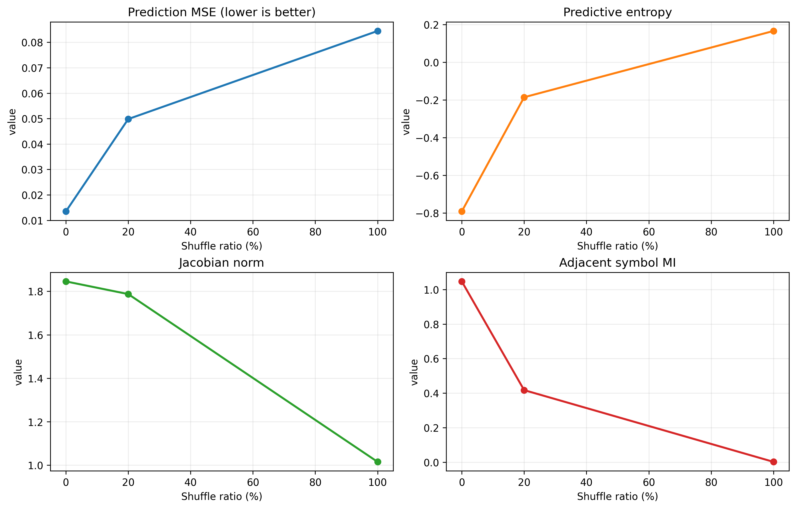

#### 4.5.2 Original vs 100% Shuffled PCA

The PCA view below isolates the most direct comparison: the original trajectory versus the fully shuffled trajectory. In the original case, the latent space still organizes into several coherent cluster-like regions. Under 100% shuffling, that temporal organization becomes much less structured and the cluster pattern looks fragmented and mixed.

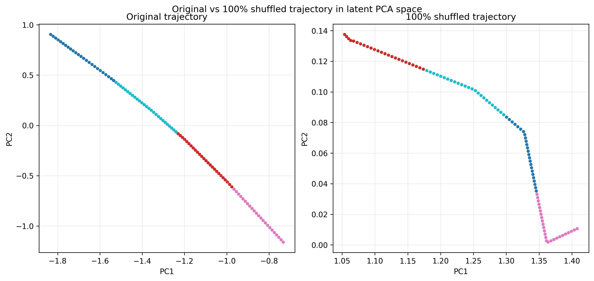


### 4.1 Original vs 100% Shuffled Trajectory

The original trajectory preserves collision-driven temporal structure, so the latent PCA often separates into stable cluster-like regions. When the same states are fully shuffled, the temporal ordering is destroyed and the latent organization becomes much less coherent. The comparison below shows the two cases side by side.


**Figure 11:** Original trajectory versus 100% shuffled trajectory in latent PCA space. The original case shows clearer cluster structure, while the shuffled case becomes more mixed and fragmented.
#### 4.5.3 Interpretation

The observed degradation follows a consistent pattern:

- **Prediction MSE rises monotonically.** As temporal structure is eroded, the world model can no longer reliably predict the next state from the past, resulting in increasing prediction loss.

- **Mean predictive entropy transitions from negative to positive.** In the original trajectory, residual variance is extremely low (negative entropy reflects high certainty). As randomization increases, residual variance expands, and entropy becomes positive—indicating that the model becomes increasingly uncertain about the next state.

- **Mean Jacobian norm decreases.** The encoder becomes less locally sensitive to input changes. This means the sharp Jacobian spikes at collision boundaries are smoothed out, and the "sharpness" of symbol boundaries diminishes as randomness increases.

- **Adjacent symbol mutual information drops to near zero.** In the original trajectory, symbols exhibit strong temporal dependence (MI > 1.0). At 20% randomization, MI drops to 0.42; at 100%, MI ≈ 0.003, indicating that the symbol sequence is nearly independent and identically distributed. The original symbolic state machine structure completely collapses.

#### 4.5.4 Summary

As trajectory randomization increases from 0% to 100%, prediction error and predictive entropy rise monotonically, while Jacobian norm and symbol MI fall monotonically. This trend demonstrates that **symbol boundaries and symbolic state machines depend critically on the environment's temporal structure**. When temporal coherence is disrupted by randomization, the world model can no longer learn a stable predictive strategy, the geometric boundaries in latent space vanish, symbolic clustering degrades into a meaningless partition, and the symbol sequence loses temporal memory.

In other words, **the premise of symbol emergence is a predictable temporal structure; once that structure is randomly destroyed, the symbolic system disintegrates accordingly.**

---

## 5. 2D Experiments

### 5.1 GridWorld Setup
To test whether the information-theoretic structure observed in 1D generalizes to spatial environments, we extend the world model to a 2D GridWorld.  
The agent performs a random walk on a \(10 * 10\) grid with four actions (left, right, up, down).  
States are normalized before training, so the same encoder, decoder, and analysis pipeline can be reused without modification.

Figure 10 shows a typical rollout, with boundary-contact states highlighted in red.

---

### 5.2 Jacobian and Predictive Entropy in 2D
**Jacobian Norm (Fig. 10a).**  
The Jacobian norm of the encoder with respect to the 2D input is computed to quantify local sensitivity.  
The resulting spatial map shows strong Jacobian spikes near walls, corners, and doorways, indicating sharp changes in local dynamics.  
These spikes correspond to dynamical boundaries in the environment.

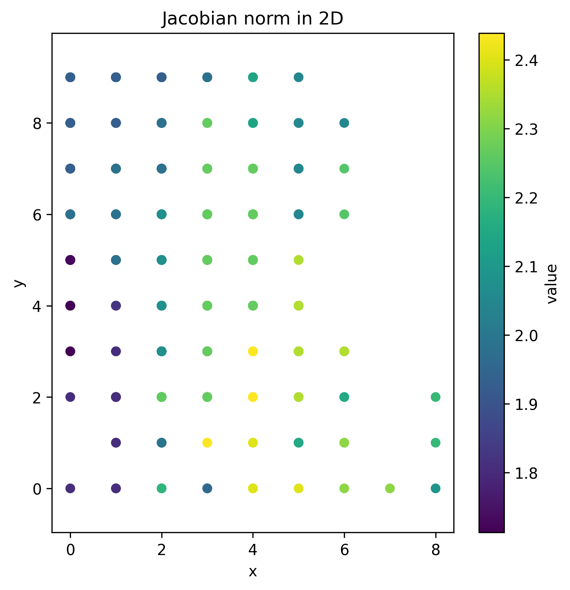

**Predictive Entropy (Fig. 10b).**  
Predictive entropy is computed using a residual-based Gaussian approximation.  
Entropy is low inside rooms and corridors, where transitions are stable, but high near boundaries, where motion becomes constrained.  
The alignment between Jacobian spikes and entropy spikes demonstrates that dynamical boundaries coincide with information boundaries.

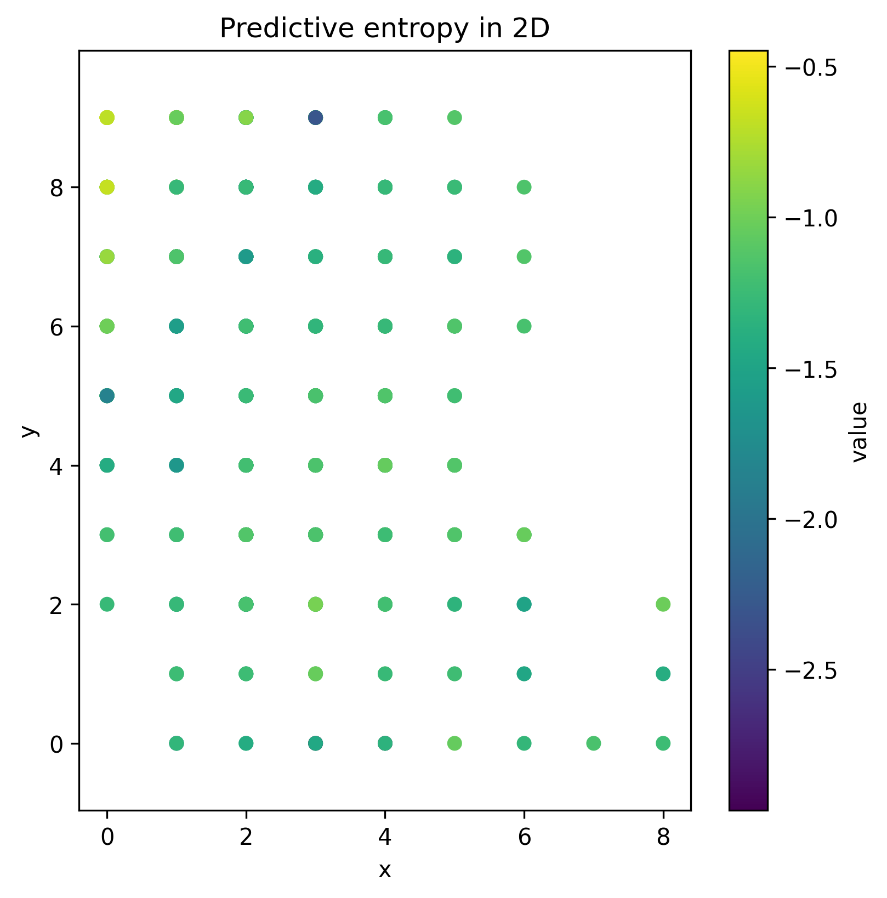

---

### 5.3 Symbolic Clusters in 2D
**Latent Clustering (Fig. 10c).**  
Clustering the latent states yields distinct spatial regions corresponding to rooms, corridors, and corner zones.  
These clusters represent minimal-uncertainty symbolic regions, extending the 1D notion of segments into 2D spatial geometry.

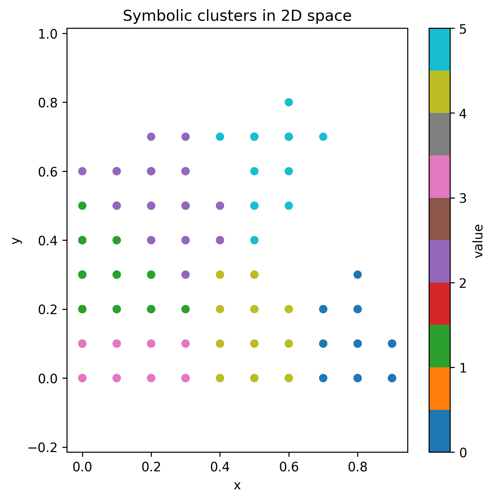

---

### 5.4 Symbol Mutual Information
**Symbol MI Matrix (Fig. 10d).**  
Mutual information between successive symbolic states is computed to reveal predictive dependencies.  
Adjacent spatial regions exhibit high MI, while distant or disconnected regions show low MI.  
This produces a symbolic adjacency structure that mirrors the topology of the environment.

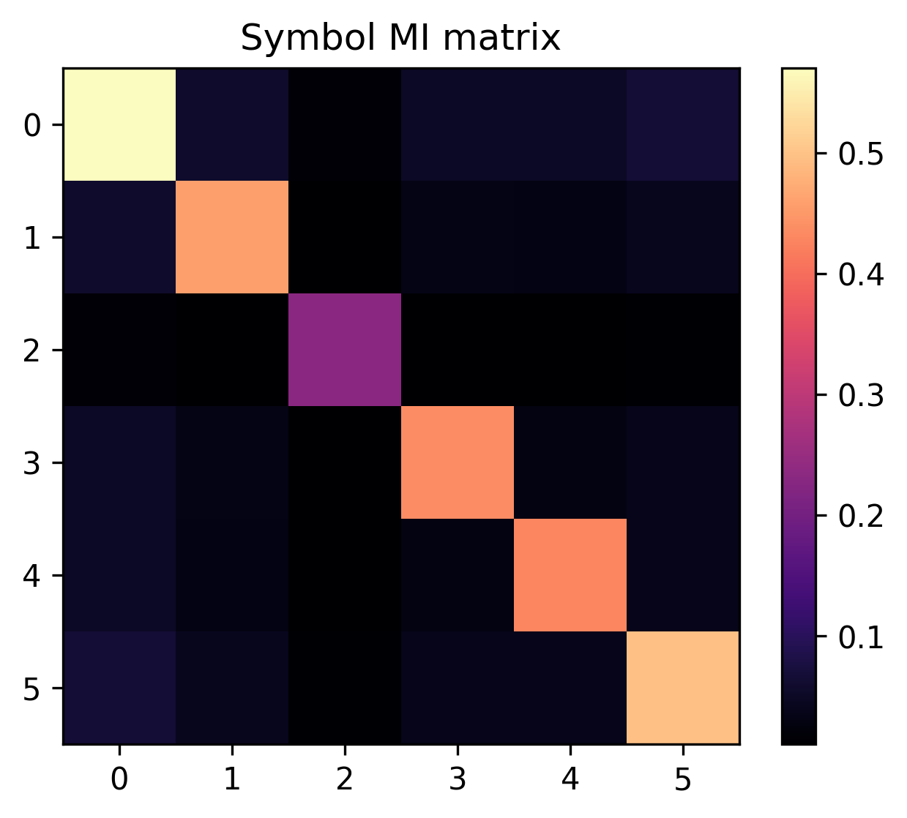

---

### 5.5 Summary
Across Jacobian, entropy, clustering, and MI analyses, the 2D results show a consistent pattern:

1. **Boundaries** (walls, corners, doorways) → Jacobian spikes + entropy spikes  
2. **Regions** (rooms, corridors) → stable low‑entropy clusters  
3. **Adjacency** → high MI between neighboring symbolic regions

Together, these results demonstrate that symbolic boundaries in world models emerge from changes in predictive structure, and that this mechanism generalizes naturally from 1D to 2D environments.  
These findings provide a spatial extension of the predictive‑geometry mechanism discussed in Section 6.

---

## 6. Randomization Control

To test whether symbol emergence depends on meaningful trajectory structure, we keep the model, loss, PCA, entropy, and clustering settings fixed and only shuffle the 1D trajectory order.

### 6.1 Original vs 100% Shuffled Trajectory

The original trajectory preserves collision-driven temporal structure, so the latent PCA often separates into stable cluster-like regions. When the same states are fully shuffled, the temporal ordering is destroyed and the latent organization becomes much less coherent. The comparison below shows the two cases side by side.


### 6.2 Shuffle Ratio Trend

The controlled study also sweeps shuffle ratios of 0%, 20%, and 100% and records how prediction error, entropy, Jacobian norm, and symbol mutual information change as trajectory order is degraded. If symbol emergence depends on meaningful temporal structure, the metrics should deteriorate as the shuffle ratio increases.


---
## 4. Discussion

### 4.1 Predictive Latent Geometry

The latent manifold reveals how predictive structure shapes representation geometry.
The PCA results suggest that the learned latent trajectory does not form an unstructured cloud, but instead lies on a low-dimensional manifold with piecewise-smooth geometry. In the one-dimensional bouncing-ball environment, the underlying dynamics are simple but not uniform: free motion, boundary approach, and post-collision motion correspond to different predictive situations. The world model must compress these situations into a representation that supports forecasting, and that compression appears to organize the latent space into connected regions with directional changes rather than a single globally smooth curve. This geometry matters because it suggests that predictive dynamics do not merely produce a compact representation; they also induce structure in that representation. In other words, the latent manifold is shaped by the requirements of prediction itself. Such a piecewise-smooth structure is a natural substrate for symbol emergence, because discrete symbolic categories can be defined as stable partitions of a continuous predictive manifold.

### 4.2 Mechanism of Symbolic Boundaries

Jacobian discontinuities provide the local signature of regime transitions.
The local mechanism behind these boundaries is the switching of ReLU activation patterns in the encoder. Because the encoder is piecewise linear, each change in activation pattern induces a new local linearization, which appears in the Jacobian as a jump or sharp change. In this setting, the Jacobian is not just a descriptive diagnostic; it marks transitions between predictive regimes. When the system approaches a collision, the model must switch from one prediction strategy to another, and that regime switching is reflected as a discontinuity in sensitivity to the input. This is why the Jacobian peaks are aligned with event boundaries in the trajectory. At the mechanistic level, a predictive regime is therefore not just a mode of behavior in the environment, but a mode of representation in the model. The correspondence between regime switching and Jacobian discontinuity is the strongest evidence in this study that symbolic boundaries can emerge from model internals rather than being imposed externally. In this sense, the boundary is "symbolic" because it separates distinct predictive organizations, and it is mechanistic because the separation is realized by a change in the encoder's local linear geometry.

### 4.3 From Manifold to Discrete Symbols

Clustering turns continuous geometry into a finite symbolic alphabet.
Once the latent geometry is segmented, k-means provides a simple way to discretize the continuous manifold into a finite set of clusters. Each cluster can be interpreted as a symbolic state: not a ground-truth label of the environment, but a stable region of the predictive latent space. The transition structure among these clusters then yields a state-transition graph, which captures how the representation moves from one predictive regime to another over time. This is the essential symbolic step in the analysis: a continuous trajectory becomes a discrete sequence of states, and the sequence can be summarized as a state-transition graph. The value of this construction is not merely visual; it shows how symbol-like categories can emerge from geometry without explicit supervision. The clustering step turns a smooth predictive manifold into a finite symbolic alphabet, and the state-transition graph turns that alphabet into structured dynamics while preserving temporal order.

### 4.4 Model-Independent Structure

Together, these results indicate that segmentation is driven by environment-induced structure rather than architecture-specific details.
The comparison across MLP, flow, and diffusion models is the strongest test of whether the observed segmentation is architecture-specific or environment-driven. For the flow model, invertibility is crucial. A flow such as RealNVP transforms latent coordinates through a sequence of bijective maps, which means it can reshape the manifold but cannot merge two distinct regions into one or create a new boundary that was not already present in the learned representation. Topology is preserved, so segmentation can be expressed in a new coordinate system but not fundamentally destroyed. This is why flow latent segmentation aligns with the MLP segmentation, and why the Procrustes comparison reveals near-identical geometry. The flow Jacobian time series further supports this view: the same event-related changes appear in the transformed latent space, indicating that the boundary structure survives the invertible mapping.

Diffusion provides a different kind of evidence. Its reverse process is stochastic, but the denoising trajectory is not arbitrary: each step follows the geometry of the data manifold by removing predicted noise and moving toward higher-density regions. Because the learned manifold is piecewise smooth, the reverse chain tends to reproduce the same large-scale bends and directional discontinuities that appear in the predictive latent trajectory. In practice, this is why diffusion reverse paths bend at similar locations, reflecting the same underlying predictive regimes, even though the trajectories are more dispersed. The key point is that diffusion is stochastic at the sampling level, but geometry-dominated at the representation level. The manifold constrains the denoising direction, so large-scale geometric trends reappear even under randomness.

Because both flow and diffusion models reproduce similar geometric bends, the segmentation appears to be driven by the environment’s predictive structure rather than by architectural details.

Taken together, these results support a unified explanation: predictive regimes impose latent geometry, geometry induces segmentation, and segmentation gives rise to symbolic boundaries. This chain does not depend on a particular architecture. Instead, it appears across deterministic predictive models, invertible flows, and stochastic diffusion models because all of them must represent the same environment-induced structure. The architectural differences change how the structure is expressed, but not whether it appears. That is the core sense in which the observed symbolic boundaries are model-independent.

### 4.5 Toward Social Symbol Emergence

While this study focuses on a single predictive agent, the resulting structure suggests a natural path toward multi-agent symbol systems. If symbolic boundaries reflect predictive regimes, then agents in the same environment may develop partially aligned segmentation patterns that can be negotiated or stabilized through communication.

The minimal framework explored here provides a foundation for such investigations. A multi-agent extension would allow us to examine how individually formed symbolic states become coordinated through interaction and how shared symbolic categories emerge from the need to predict each other's behavior. This perspective is consistent with the broader account of symbol emergence proposed in Symbol Emergence Systems (2026), in which social interaction plays a central role in transforming individual predictive structures into communal symbol systems.

## Conclusion

The experiments presented in this work show that discrete symbolic structure can emerge from the geometry of predictive latent spaces, even in a minimal one-dimensional environment. The latent trajectory learned by the world model forms a piecewise-smooth manifold whose directional changes align with transitions between predictive regimes. These regime boundaries appear as discontinuities in the encoder Jacobian and can be discretized into symbolic states that summarize the environment's dynamics in compact form.

A key finding is that this structure is not specific to a particular architecture. Invertible flow models preserve the same segmentation because they cannot alter the topology of the latent manifold, while diffusion models reproduce similar large‑scale geometric bends through geometry‑guided denoising, though the stochastic reverse chain yields more dispersed trajectories. The consistency of these results across deterministic predictive models, invertible flows, and stochastic diffusion models suggests that symbolic boundaries arise from the environment's predictive structure rather than from architecture-specific inductive biases.

Although the present study focuses on a single predictive agent, the resulting framework provides a foundation for exploring symbol emergence in multi-agent settings. If symbolic boundaries reflect predictive regimes, then agents interacting in the same environment may develop partially aligned segmentation patterns that can be negotiated or stabilized through communication. Understanding how such individually formed structures become shared symbolic systems is an important direction for future work and connects directly to broader theories of symbol emergence in cognitive and social systems.


## 7. Conclusion

This report examined how symbolic boundaries can emerge from the predictive structure of a learned world model.  
In the 1D bouncing-ball environment, the latent manifold organizes into piecewise-smooth regions corresponding to distinct predictive regimes, and Jacobian discontinuities mark transitions between these regimes.  
Clustering these regions yields a discrete symbolic alphabet whose transition structure reflects the underlying dynamics.  
Comparisons across MLP, flow, and diffusion models show that this mechanism is model-independent: predictive regimes impose geometry, geometry induces segmentation, and segmentation yields symbolic structure.

The 2D GridWorld experiments further demonstrate that this mechanism generalizes to spatial environments.  
Walls, corners, and doorways induce the same geometric bends and Jacobian spikes observed in 1D, producing symbolic regions aligned with rooms, corridors, and spatial constraints.  
Mutual information between symbolic states recovers the adjacency structure of the environment, showing that predictive geometry scales naturally from 1D trajectories to 2D spatial topology.

Together, these results provide a unified, mechanistic account of how discrete symbols can emerge from continuous predictive experience, offering a foundation for future work on multi-agent symbol negotiation and shared semantic structure.


## Appendix

### PCA as a Geometric Operator

PCA provides a global view of the latent manifold, complementing the local sensitivity captured by the Jacobian.

PCA can be interpreted geometrically as fitting an ellipsoid to the centered data cloud. Centering is 
necessary because PCA assumes that the linear transformation acts around the origin; without 
centering, the mean shift would be interpreted as variance.

Given a centered data matrix X, PCA seeks directions v that maximize the projected variance:

    maximize   vᵀ (Xᵀ X) v
    subject to ||v|| = 1

The solution is given by the eigenvectors of XᵀX, with the largest eigenvalue corresponding to the 
first principal component.

SVD provides an equivalent and more geometric interpretation. Any linear transformation maps the 
unit circle into an ellipse whose axes correspond to the singular vectors. The first right singular 
vector identifies the direction of maximal stretching, which is identical to the first principal 
component. Thus, PCA can be computed directly via the SVD of the centered data matrix:

    X = U Σ Vᵀ

where the columns of V are the principal directions and the squared singular values Σ² correspond to 
the explained variances.

### Implementation Notes

All experiments were run with fixed seeds for reproducibility.

The repository contains the code used to generate the figures and the corresponding training scripts. The default settings are summarized below for readers who want to reproduce or extend the experiments.

| Item | Value (repository) | Notes |
|---|---:|---|
| Environment | 1D bouncing-ball (deterministic) | `data/generate_data.py` |
| Latent dimension | 16 | Default CLI value used by `model/train.py` |
| Encoder | Linear(1,32) -> ReLU -> Linear(32, latent_dim) | `model/world_model.py::WorldModel` |
| Decoder | Linear(latent_dim,32) -> ReLU -> Linear(32,1) | `model/world_model.py::WorldModel` |
| Optimizer | Adam | Used across trainers |
| Learning rate | 1e-3 | Default training rate in `model/train.py` |
| Batch size | 32 (world), 128 (flow/diffusion) | Dispatcher defaults |
| Epochs | 50 (world), 300 (flow), 1000 (diffusion) | Default epoch schedule |
| Flow model | RealNVP, num_layers=8, hidden_dim=128 | Invertible baseline |
| Diffusion model | timesteps=1000, hidden_dim=256, time_embed_dim=128 | Generative baseline |
| PCA | `sklearn.decomposition.PCA(n_components=2)` | Latent-geometry summary |
| Clustering | `KMeans(n_clusters=4, n_init=20, random_state=0)` | Symbolic segmentation |
| Jacobian computation | autograd | See the subsection above |

Example commands:

```bash
python -m pip install -r requirements.txt
python model/train.py --mode world --latent-dim 8 --lr 1e-3 --batch-size 32 --epochs 50
python model/train.py --mode flow --lr 5e-4 --batch-size 128 --epochs 300
python model/train.py --mode diffusion --timesteps 1000 --lr 5e-4 --batch-size 128 --epochs 1000
python model/eval.py --checkpoint model/checkpoint.pth --plot_dir figures/
```

### 2D GridWorld Reproduction

The 2D extension uses the same model architecture with `state_dim=2` and a normalized GridWorld rollout. Run it with:

```bash
python envs/collect_2d.py
python model/train.py --mode world --data-path data/trajectories_2d.npy --state-dim 2 --epochs 20 --batch-size 32 --latent-dim 16
python analysis/run_analysis.py
python analysis/segmentation.py
```

This reproduces the 2D Jacobian norm map, predictive entropy map, symbolic cluster map, and symbol MI matrix saved under `report/figures/gridworld/`.

Record the exact git commit hash and configuration file for each experiment. Where possible, save model checkpoints, training curves, and generated figures alongside the run metadata.

## References

- Taniguchi, T., et al. (2026). *Symbol Emergence Systems: An Interdisciplinary Discussion About Cognition, Language and Society*. Springer.
- Taniguchi, T., et al. (2016). *Symbol emergence in cognitive developmental systems: A survey*. IEEE Transactions on Cognitive and Developmental Systems.
- Nakamura, T., et al. (2014). *Multimodal categorization and symbol emergence*. Advanced Robotics.
- Ha, D., & Schmidhuber, J. (2018). *World Models*. arXiv:1803.10122.
- Ho, J., Jain, A., & Abbeel, P. (2020). *Denoising Diffusion Probabilistic Models*. NeurIPS.
- Dinh, L., Sohl-Dickstein, J., & Bengio, S. (2017). *Density estimation using Real NVP*. ICLR.
- Arora, R., et al. (2018). *Understanding deep neural networks with rectified linear units*. ICLR.
- MacQueen, J. (1967). *Some methods for classification and analysis of multivariate observations*. Berkeley Symposium.